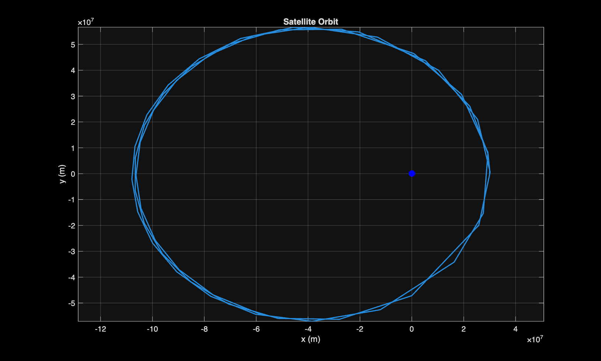

# 2-body-orbital-system
Simulate a simplified 2-body orbital system (satellite around Earth) using Newton's law of gravitation. Displacement is calculated by integrating velocity integrating acceleration. 
Inital condition of at 3x10^7 meters above Earths centre.

Figure produce with inital velcoty set to 4500 m/s tangent to Earth's centre.
