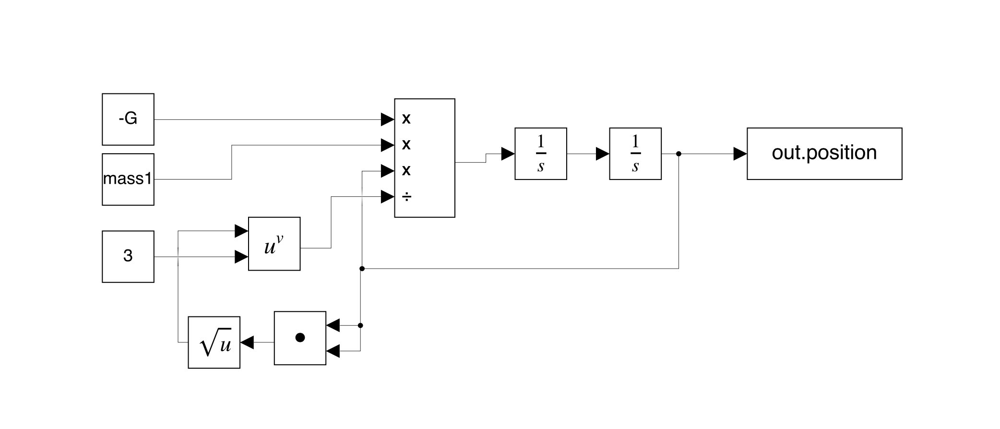
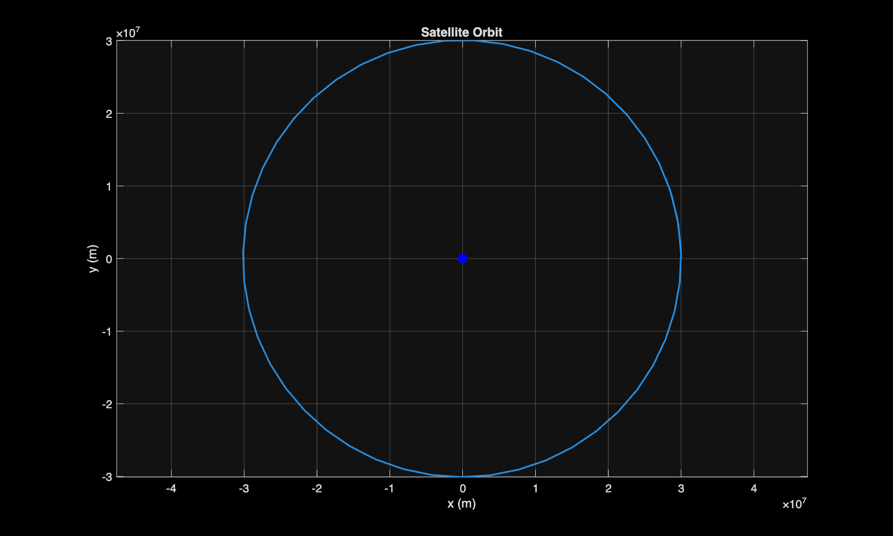
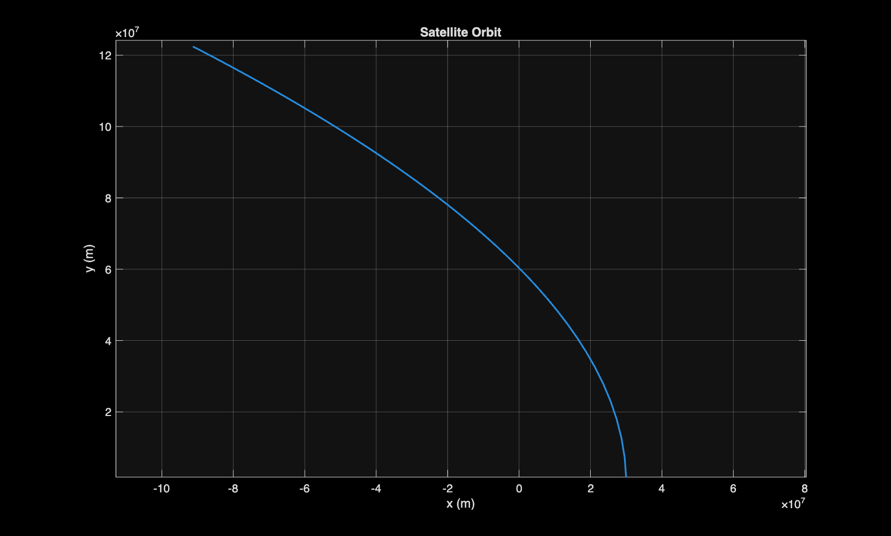

# 2-body-orbital-system
Simulate a simplified 2-body orbital system (satellite around Earth) using Newton's law of gravitation. Displacement is calculated by integrating velocity integrating acceleration. 
Inital condition of at 3x10^7 meters above Earths centre.
Simulink model:

Figure produce with inital velcoty set to 4500 m/s tangent to Earth's centre.

Figure produce with inital velcoty set to 3650 m/s tangent to Earth's centre. The innital veclocity is calculated by v = sqrt(GM/r) which is the veclocity needed for a circular orbit.

Figure produce with inital velcoty set to 5670 m/s tangent to Earth's centre. The innital veclocity is calculated by v = sqrt(2GM/r) which is the veclocity needed to escape Earth's gravitational field.
